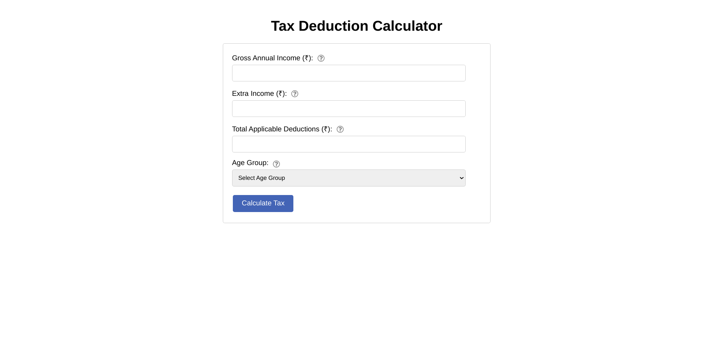
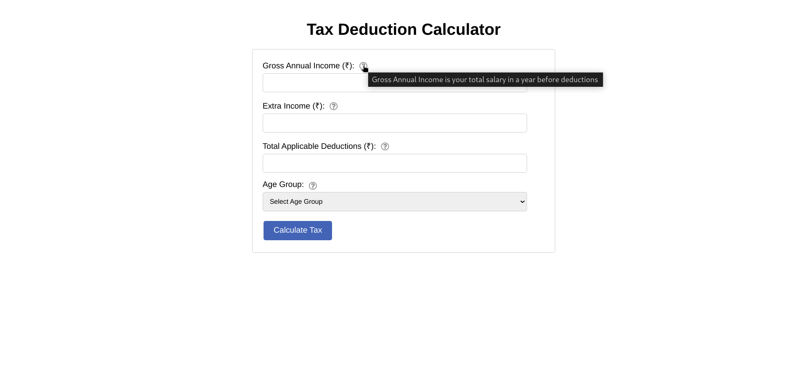
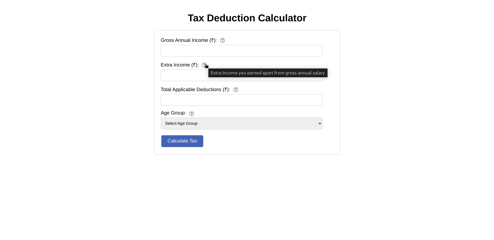
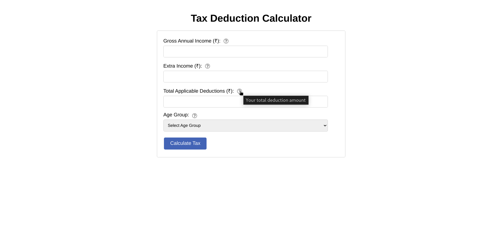
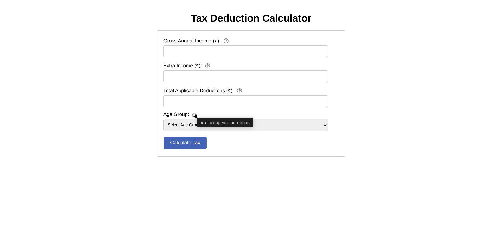
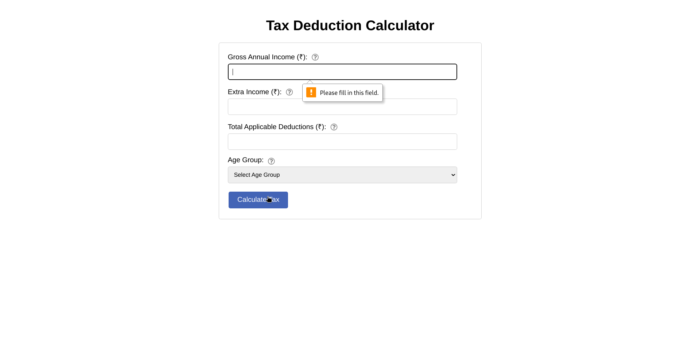
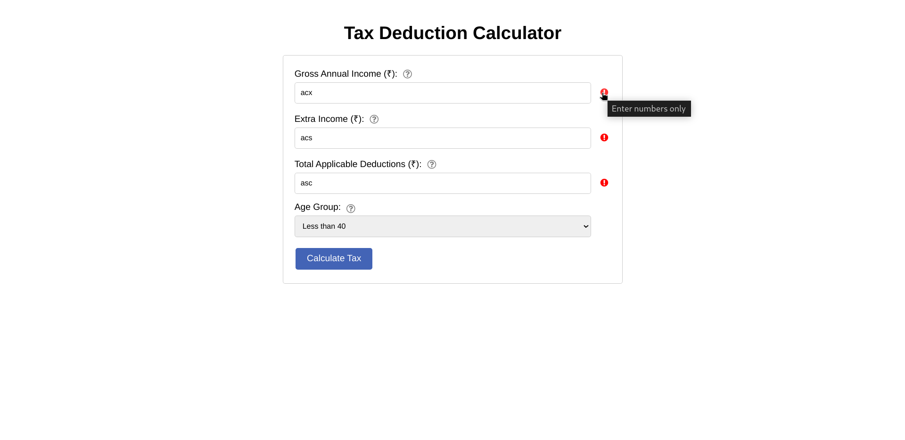
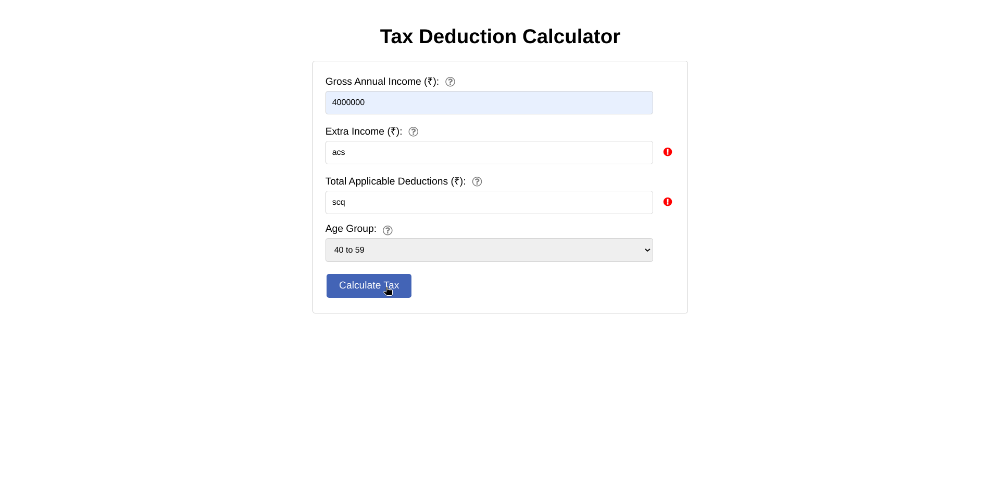
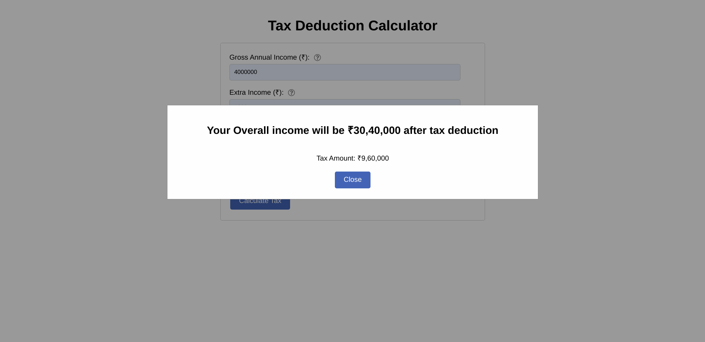

# Tax Deduction Calculator

This is a simple web application to calculate tax deduction based on gross annual income, extra income, total applicable deductions, and age group.

## How to Use

1. Enter your Gross Annual Income (₹), Extra Income (₹), Total Applicable Deductions (₹), and select your Age Group.
2. Click on the "Calculate Tax" button.
3. View the calculated tax amount and overall income after tax deduction.
4. Click "Close" to dismiss the modal.

## Technologies Used

- HTML
- CSS
- JavaScript

## Tests

- [x] Ensure all input fields are filled before submitting.
- [x] Ensure only numbers are entered in input fields.
- [x] Ensure correct tax calculation based on income and age group.
- [x] Ensure modal displays correct information after calculation.

## Screenshots

- home page
  

- with info about each field
  
  
  
  

- with error if fields are left empty
  

- with error if numbers is not added
  
  

- final ans with popup
  
